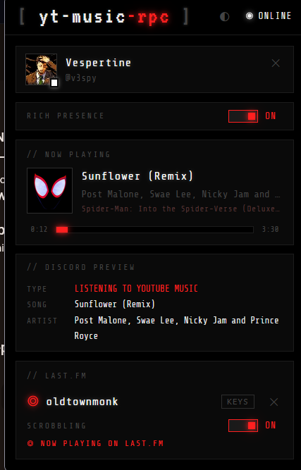
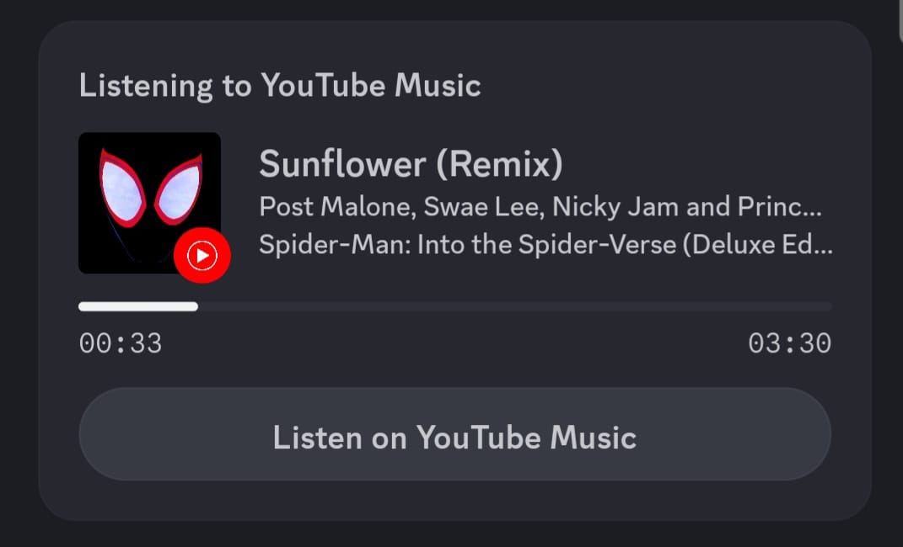

# <p align="center"> yt-music-rpc</p>

<p align="center">
  <strong>YouTube Music ➜ Discord Rich Presence + Last.fm Scrobbling</strong><br />
  <em>A lightweight browser extension for Firefox &amp; Chromium-based browsers. No desktop client, bridge, or native app required.</em>
</p>

<p align="center">
  
  
  
</p>

<p align="center">
  
  
  
  
  
</p>

## Screenshots

| Extension view | Discord view |
|---|---|
|  |  |

---

## Features

*   **Listening Status** — Shows up on your Discord profile as "Listening to YouTube Music" (just like official Spotify integration).
*   **Track Metadata** — Displays current song title, artist, and album.
*   **Dynamic Artwork** — Fetches and displays high-quality album art directly from YouTube Music's CDN.
*   **Live Progress** — Synchronizes start and end timestamps so your status bar tracks the song length in real time.
*   **Zero-Config Discord Login** — Automatically detects your active Discord session in the browser to connect. No pasting credentials or client IDs.
*   **Last.fm Scrobbling** — Automatically scrobbles tracks to your Last.fm profile. Follows the official scrobbling rules (50% played or 4 minutes, whichever comes first). Sends "Now Playing" instantly when a track starts.
*   **Minimalist Dot-Matrix UI** — A beautiful Nothing-brand inspired retro UI with dark/light themes.

---

## Installation

### Firefox
1. Open Firefox and navigate to `about:debugging`
2. Click **This Firefox** on the left menu.
3. Click **Load Temporary Add-on...**
4. Select the `manifest.json` file inside this repository.
5. The extension icon will appear in your toolbar.

### Chrome / Edge / Brave / Opera
1. Open your browser and head to the extensions page (e.g. `chrome://extensions` or `brave://extensions`).
2. Toggle **Developer mode** in the top-right corner.
3. Click the **Load unpacked** button in the top-left.
4. Select this project's root folder.
5. Pin the extension to your toolbar.

---

## First-Time Setup

### Discord Rich Presence
1. Click the **yt-music-rpc** toolbar icon to open the popup.
2. Ensure you are logged into [discord.com](https://discord.com) in this browser profile.
3. Click the **CONNECT TO DISCORD ›** button.
4. A Discord tab will open in the background to automatically authorize the session and will close after 3 seconds.
5. Return to the popup UI. You are now fully connected!
6. Navigate to [music.youtube.com](https://music.youtube.com) and start playing music to see it update.

### Last.fm Scrobbling (Optional)
1. Register a free API application at [last.fm/api/account/create](https://www.last.fm/api/account/create) (takes ~30 seconds).
2. Click the **yt-music-rpc** toolbar icon to open the popup.
3. In the popup, scroll to the **// LAST.FM** section.
4. Paste your **API Key** and **API Secret** and click **SAVE API KEYS ›**.
5. Once saved, enter your Last.fm username and password and click **CONNECT LAST.FM ›**.
6. Your credentials are saved securely in browser extension storage (`browser.storage.local`) and are never sent anywhere except directly to Last.fm's API.
7. Toggle scrobbling on/off at any time without disconnecting.

---

## Architecture

The extension runs entirely client-side without any third-party databases:

```
yt-music-rpc/
├── manifest.json            # Extension manifest (MV2)
├── background.js            # Discord Gateway WS, Last.fm scrobbling logic
├── content.js               # Scrapes YouTube Music player via MediaSession & <video> events
├── discord-cs.js            # Local token extractor fallback for Discord auth
├── lastfm.js                # Last.fm API helper (MD5 signing, auth, nowPlaying, scrobble)
├── lastfm-config.example.js # Reference file explaining the new API storage layout
└── popup/
    ├── popup.html           # Dot-matrix user interface
    ├── popup.js             # Live state synchronization, Discord + Last.fm wiring
    └── popup.css            # Custom retro styling with dark/light themes
```

---

## Scrobbling Algorithm

Follows the [official Last.fm scrobbling specification](https://www.last.fm/api/scrobbling):

| Event | When |
|---|---|
| `track.updateNowPlaying` | Immediately when a new track starts playing |
| `track.scrobble` | After `min(50% of track duration, 4 minutes)` has elapsed |
| No scrobble | If track is shorter than 30 seconds |
| No duplicate scrobble | Same `(title + artist + start timestamp)` is never submitted twice |

---

## Disclaimer

> [!WARNING]
> Logging in to Discord's Gateway with a user token to set custom activity presence ("self-botting") is technically outside Discord's official Terms of Service. This extension is an open-source, client-side personal tool. Use at your own discretion.
